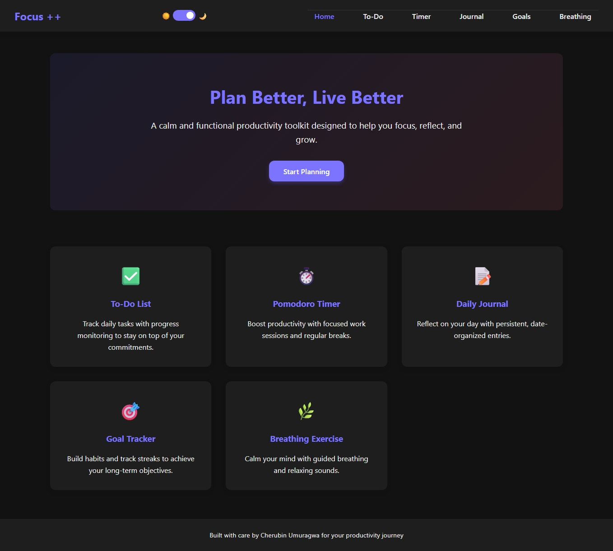
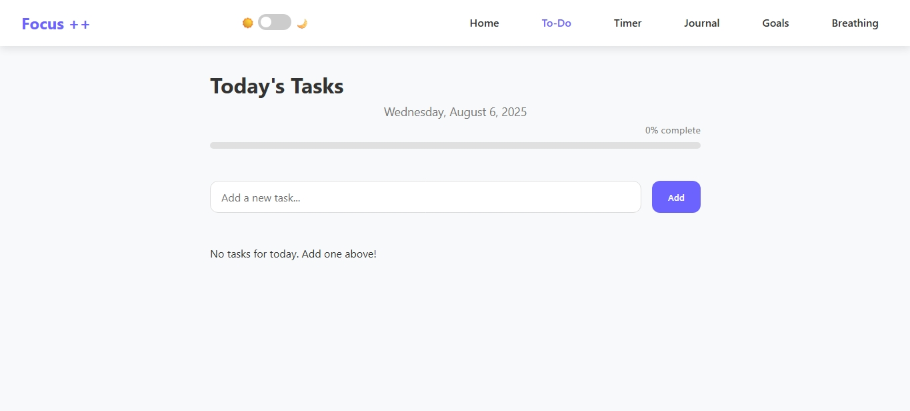
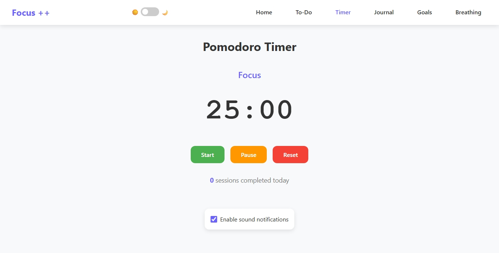
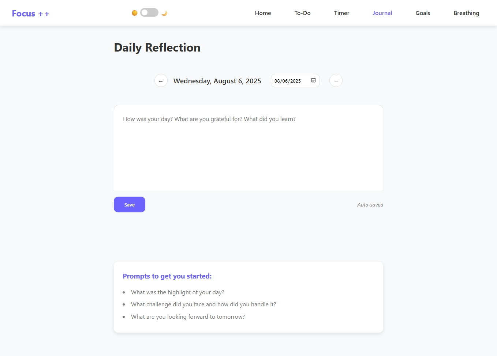
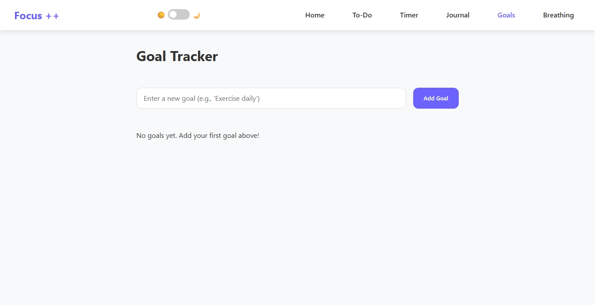
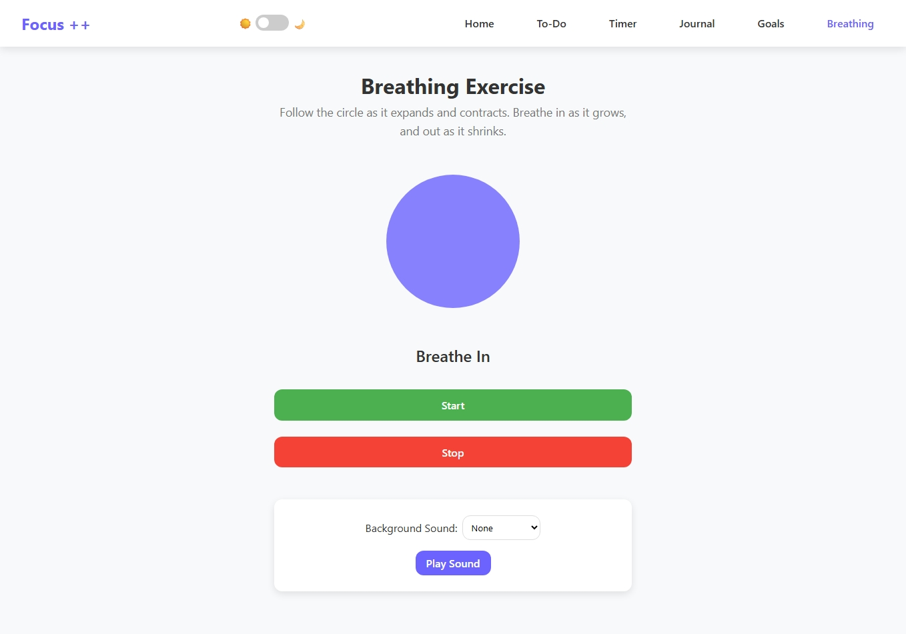

# 🌟 Focus++ – Productivity Web App

**Focus++** is a calm and functional productivity toolkit designed to help you **focus**, **reflect**, and **grow** – all in one place.

---

## 📑 Table of Contents
- [💡 Motivation & Inspiration](#-motivation--inspiration)
- [✨ Features](#-features)
- [🛠️ Technologies Used](#️-technologies-used)
- [📥 Running Locally](#-running-locally)
- [📸 Screenshots](#-screenshots)
- [🔗 Links](#-links)
- [📬 Contact](#-contact)
- [📜 License](#-license)

---

## 💡 Motivation & Inspiration
In today’s fast‑paced world, it’s easy to get overwhelmed by distractions, endless to‑do lists, and lack of work–life balance.  
**Focus++** was created to provide a **simple, calm, and offline‑friendly toolkit** that helps users stay productive, build habits, and prioritize their mental well‑being.  

This idea was inspired by:
- The need for **one lightweight platform** that combines essential productivity tools instead of juggling multiple apps.
- The belief that **small daily improvements** can lead to significant personal growth.

---

## ✨ Features
- ✅ **To-Do List** – Organize your daily tasks with progress tracking  
- ⏱️ **Pomodoro Timer** – Stay productive with focused work intervals  
- 📝 **Daily Journal** – Record your thoughts with persistent entries  
- 🎯 **Goal Tracker** – Build habits and track streaks to stay motivated  
- 🌿 **Breathing Exercise** – Relax and improve focus with guided breathing  

---

## 🛠️ Technologies Used
- **HTML5** – Structure & semantic markup
- **CSS3** (Flexbox, Grid) – Responsive styling
- **Vanilla JavaScript** – Interactive features
- **LocalStorage** – Offline data persistence
- **Responsive Design** – Works on mobile, tablet, and desktop

---

## 📥 Running Locally
1. **Clone** this repository:
   git clone https://github.com/cham-tech/Focus_-.git
2. **Open the project folder** and double-click index.html
**No server required** – works directly from your file system

---

## 📸 Screenshots

| Home Page                                        | To-Do List                             | Pomodoro Timer                              |
| ------------------------------------------------ | -------------------------------------- | ------------------------------------------- |
|  |  |  |

| Journal Page                           | Goals Tracker                      | Breathing Exercise                         |
| -------------------------------------- | ---------------------------------- | ------------------------------------------ |
|  |  |  |

---

## 🔗 Links

**[Live Demo](#) (Coming Soon)**
**[Video Demo](#) – (Coming Soon)**
**[GitHub Repository](https://github.com/cham-tech/Focus_-.git)**

---

## 📬 Contact

**[Email](mailto:"cherubinamani09@gmail.com")**
**[Discord](https://discord.com/users/1267949776071299092)**

---

## 📜 License

This project is licensed under the MIT License – you’re free to use, modify, and distribute it.
